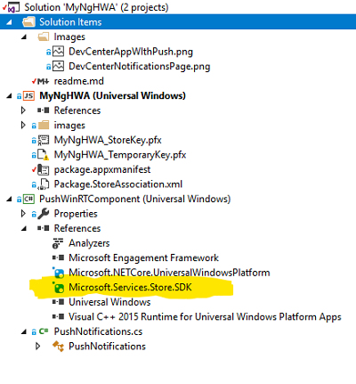
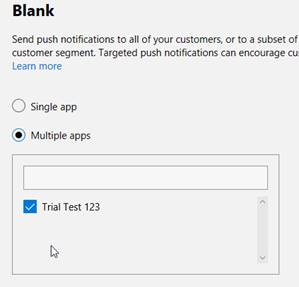

# Add Push Notifications to your app the easy way with Partner Center + Microsoft Store Services SDK


* What if I told you that you could implement Windows toast and tile notifications with just two lines of code? Would you be interested?
  
* What if I told you that you didn't have to implement any server side code? Are you more interested? 
  
* What if I told you that you could do this in your progressive web app, UWP or Win 32 app? Is your interest now off the charts?? If so, read on!

With the combination of the [Partner Center Engagement Feature](https://docs.microsoft.com/en-us/windows/uwp/publish/send-push-notifications-to-your-apps-customers) and the [Microsoft Store Services SDK](https://docs.microsoft.com/en-us/windows/uwp/mosnetize/microsoft-store-services-sdk) you can easily add Push Notifications to your [Windows Progressive Web App](https://docs.microsoft.com/en-us/microsoft-edge/progressive-web-apps) (PWA), [UWP](https://docs.microsoft.com/en-us/windows/uwp/get-started/universal-application-platform-guide), or [Desktop Bridge - Win32 app](https://aka.ms/desktopbridge).


## Powerful Push   
</div>
Push notifications in Windows are very powerful and flexible allowing you to target specific information to specific users. This, however, requires you integrate with the Windows Notifications Service (WNS), set up a server app to send notifications and add code to your client application that registers with WNS. While this gives the developer flexibility and one to one targeting, it may be more than what you need. For an excellent walkthrough of setting up WNS Push Notifications, see this post, [Push notifications in a PWA running on Windows 10](https://blogs.msdn.microsoft.com/appconsult/2018/06/07/push-notifications-in-a-pwa-running-on-windows-10/) written by [Matteo Pagani](https://twitter.com/QmatteoQ).

## Easy Push  

In contrast to 'Powerful Push', 'Easy Push' sends general updates to all users of your app. That is, you don't send specific data to specific users. This is very useful for:

* Cross promoting your apps. For example, if you have launched a new app, ask your user of your other apps to check it out.
* Letting your users know when your apps or IAP go on [sale](https://docs.microsoft.com/en-us/windows/uwp/publish/set-and-schedule-app-pricing).
* Requesting feedback.
* Sending ad hoc announcements and information to your users.

Microsoft Store Services notifications support [interactive toast messages](https://docs.microsoft.com/en-us/windows/uwp/design/shell/tiles-and-notifications/adaptive-interactive-toasts) which allow users to interact with your application without having to launch it.

Microsoft Store Services notifications can't send information customized for a specific user. For these types of notifications, see 'Powerful Push' above.

## Let's see the code!

To implement the Microsoft Store Services notifications you will:

1) Install the [Microsoft Store Services SDK](https://docs.microsoft.com/en-us/windows/uwp/mosnetize/microsoft-store-services-sdk) 

2) Add a Reference to the ```Microsoft.Services.Store.SDK``` in your project. See highlighted below:



4) Add the following code to the Start up of your app:

```cs
// Setup connection between app and Microsoft Partner Center Push Services
StoreServicesEngagementManager engagementManager = StoreServicesEngagementManager.GetDefault();
var res = await engagementManager.RegisterNotificationChannelAsync();
```

5) Publish your app to Partner Center using the ['Limited Audience' or 
'Hidden' visibility options](https://docs.microsoft.com/en-us/windows/uwp/publish/choose-visibility-options). You need to do this because in order to setup the push notifications Partner Center will need to explicitly reference your app. In order to do this, you app must be published with a reference to the ```Microsoft.Services.Store.SDK```. Note that the publishing process can take up to three business days.

6) Once the app has published, you don't need to install it from the Store. You can continue to develop the app - just make sure the [identity](https://docs.microsoft.com/en-us/windows/uwp/publish/view-app-identity-details) of the app matches what you have submitted to Partner Center.

7) In the `Engagement` section of `Windows Partner Center` define and send your Toast and Tile Push Notifications.


   7.1. In `Partner Center`, select `Engage` and you should see the `Notifications` page as shown below.

   

   7.2. Click `New Notification`

   7.3. Click `Blank Toast`, `OK`

   7.4. From the drop down, select the application you wish to send notifications. See screenshot below:

   

   7.5 Here are some sample values for this toast notification:

   **Name:** My First Engagement Push
   
   **Customer Groups:** All Users
   
   **Send Notification Immediately:** Check
   
   **Notification Never Expires:** Check
   
   **Language:** English (default)
   
   **Activation Type:** Foreground
   
   **Duration:** Short
   
   **Scenario:** Default
   
   **Visual (text 1):** Hello from My App!

   Click `Send`

Your notification will be sent immediately it will take up to 1 minute to receive the notification. Note that the app's registration code (Step 4) should have been run at least once. Also the app doesn't need to be running in order to receive the notification.

Did it arrive? Yes. High-Five!
No? Here are some things to check:

* Did the registration code run?
* Does the app's [identity](https://docs.microsoft.com/en-us/windows/uwp/publish/view-app-identity-details) match it's definition in Partner Center?
* Are you sending the notification to the correct app?

## How about a sample?

In the following steps, I'll describe the code found here: windows microsoft pwa TODO

Since this sample is a PWA, the registration has to be done indirectly via a Windows Runtime Component (PushWinRTComponent). I've exposed a method `Init()` that will be called via JavaScript.

In your `index.html` the following JavaScript is called:

```javascript
// Set up Push notifications
if (typeof Windows !== 'undefined' &&
  typeof Windows.UI !== 'undefined' &&
  typeof Windows.UI.Notifications !== 'undefined') {
  PushWinRTComponent.PushNotifications.init().then(
    function (result) {
      console.log("push init result: " + result);
    });
}
```

References:

[Send notifications to your app's customers](https://docs.microsoft.com/en-us/windows/uwp/publish/send-push-notifications-to-your-apps-customers)

[Push Notifications in a PWA Running on Windows 10](https://blogs.msdn.microsoft.com/appconsult/2018/06/07/push-notifications-in-a-pwa-running-on-windows-10/)
